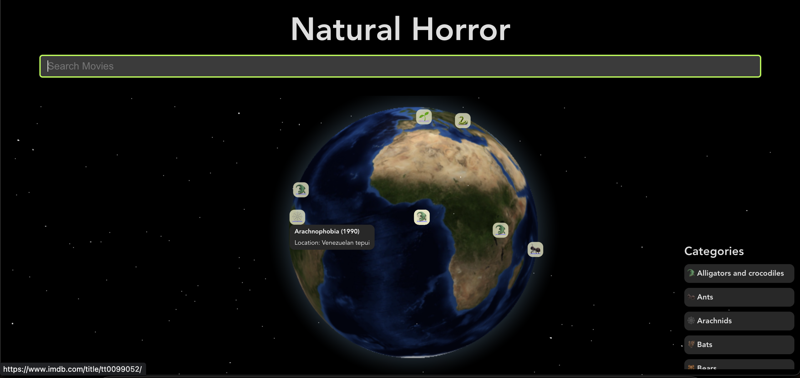

# Natural horror movies

Figuring out where natual horror movies usually occur



## Why?

I was bored out of my mind, so I ended up in a Wikipedia rabbit hole and landed
on this [amazing list](https://en.wikipedia.org/wiki/List_of_natural_horror_films).
I decided to write a small script to scrape some horror movies and figure out where
they occurred, along with some more details. Then, for fun, I plotted them on a map.

## How to run it

```
$ pnpm
$ pnpm dev
```

## How to add movies to this list?

The list of movies is by no means exhaustive. You can help us add more
to this list by creating a PR to add entry to `src/public/data.json`
Use the format for the newly added item

```
  {
    "animal": "Great white shark",
    "category": "Sharks",
    "fictional": "",
    "movie": "Bait 3D",
    "lat": "-33.865143",
    "link": "https://www.imdb.com/title/tt1438173/",
    "location": "Australia",
    "lng": "151.2099",
    "year": "2012",
    "type": "Point",
    "coordinates": [151.2099, -33.865143]
  }
```
